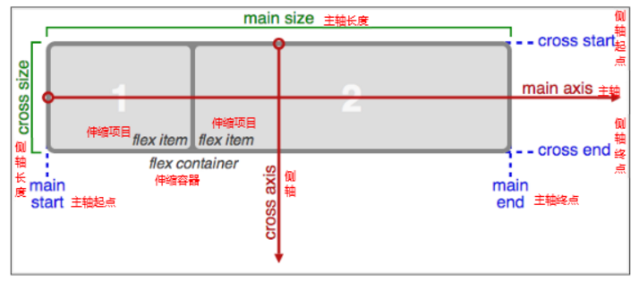

先看例子：

```
			/*伸缩布局，默认水平方向*/
			display: flex;
```

~~~html
<!DOCTYPE html>
<html>
<head>
	<title>flex伸缩布局</title>
	<meta charset="utf-8">
	<style type="text/css">
		section{
			width: 800px;
			height: 150px;
			margin: 50px auto;	
			/*伸缩布局，默认水平方向*/
			display: flex;
			/*垂直分布 ,默认水平分布*/
			/*flex-direction: column;*/
			/*section最小的宽度就是 500*/
			min-width: 500px;   

		}
		section div:nth-child(1){
			background-color: pink;
			/*占一份*/
			flex:1;
		}
		section div:nth-child(2){
			background-color:purple;
			/*占2份*/
			flex:2;
			/*伸缩布局并不会受内外边距的影响而影响大小*/
			margin: 0 10px;
		}
		section div:nth-child(3){
			background-color:blue;
			/*每人平均一份*/
			/*flex:1;*/

			/*设置固定宽度也不会影响另两个的伸缩*/
			width: 200px;
		}

	</style>
</head>
<body>
	<section>
		<div>1</div>
		<div>2</div>
		<div>3</div>
	</section>
</body>
</html>
~~~


## 伸缩布局(CSS3)

CSS3在布局方面做了非常大的改进，使得我们对块级元素的布局排列变得十分灵活，适应性非常强，其强大的伸缩性，在响应式开中可以发挥极大的作用。

主轴：Flex容器的主轴主要用来配置Flex项目，默认是水平方向

侧轴：与主轴垂直的轴称作侧轴，默认是垂直方向的

方向：默认主轴从左向右，侧轴默认从上到下

主轴和侧轴并不是固定不变的，通过flex-direction可以互换。




Flex布局的语法规范经过几年发生了很大的变化，也给Flexbox的使用带来一定的局限性，因为语法规范版本众多，浏览器支持不一致，致使Flexbox布局使用不多

**2、各属性详解******

1.flex子项目在主轴的缩放比例，不指定flex属性，则不参与伸缩分配

min-width  最小值      min-width: 280px  最小宽度  不能小于 280

max-width: 1280px  最大宽度  不能大于 1280

2.flex-direction调整主轴方向（默认为水平方向）

flex-direction: column 垂直排列

flex-direction: row  水平排列

http://m.ctrip.com/html5/   携程网手机端地址


模拟携程网

~~~html
<!DOCTYPE html>
<html lang="en">
<head>
	<meta charset="UTF-8">
	<title>Document</title>
	<style>
	* {
		margin: 0;
		padding: 0;
		box-sizing: border-box;
	}
	html, body {
		min-width: 320px; 
		max-width: 540px;
		margin: 0 auto;
		font: normal 14px/1.5 Tahoma,"Lucida Grande",Verdana,"Microsoft Yahei",STXihei,hei;
	}
	header {
		height: 108px;
	}
	header img {
		height: 100%;
		width: auto;
	}
	nav {
		border: 1px solid #ccc;
		padding: 4px;
	}
	nav  a  {
		text-decoration: none;
		color: #fff;
		text-shadow: 0 2px 1px rgba(0,0,0,.2);
		/*text-shadow:水平位置 垂直位置 模糊距离 阴影颜色;*/
	}
	.row {
		height: 90px;
		display: flex; /*伸缩布局*/
		border-radius: 5px; 
		overflow: hidden;
		margin-bottom: 5px;
	}
	.row div {
		height: 100%;
		flex: 1;
		background-color: #FF697A;
		border-right: 1px solid #fff;
	}
	.row div:nth-child(3) {
		border-right: 0;
	}
	.row div a {
		display: block;
		width: 100%;
		height: 100%;
	}
	.row33 {
		display: flex;
		flex-direction: column;
	}
	.row33 a {
		flex: 1;
		text-align: center;
		line-height: 45px;
	}
	.row33 a:first-child {
		border-bottom: 1px solid #fff;
	}
	.row em {
		display: block;
		height: 45px;
		text-align: center;
		line-height: 45px;
		font-style: normal;
	}
	.row i {
		display: block;
		width: 43px;
		height: 43px;
		margin: -5px auto 0;
		background: url(images/ctrip.png) no-repeat 0 -127px;
		-webkit-background-size: 104px;  /* 前缀 */
		-moz-background-size: 104px;  /* 前缀 火狐 */
		-ms-background-size: 104px;  /* 前缀 ie */
		-o-background-size: 104px;  /* 前缀 ie */
		background-size: 104px;

	}
	.row .icon-flight {
		background-position: 0 -288px;
	}

	</style>
</head>
<body>
	<header>
		
	</header>
	<nav>
		<div class="row">
			<div>
				<a href="#">
					<em>酒店</em>
					<i></i>
				</a>
			</div>
			<div class="row33">
				<a href="#">海外酒店</a>
				<a href="#">特价酒店</a>
			</div>
			<div class="row33">
				<a href="#">团购</a>
				<a href="#">同福客栈</a>
			</div>
			
		</div>
		<div class="row">
			<div>
				<a href="#">
					<em>酒店</em>
					<i class="icon-flight"></i>
				</a>
			</div>
			<div class="row33">
				<a href="#">海外酒店</a>
				<a href="#">特价酒店</a>
			</div>
			<div class="row33">
				<a href="#">团购</a>
				<a href="#">同福客栈</a>
			</div>
			
		</div>
		<div class="row">
			<div>
				<a href="#">
					<em>酒店</em>
					<i></i>
				</a>
			</div>
			<div class="row33">
				<a href="#">海外酒店</a>
				<a href="#">特价酒店</a>
			</div>
			<div class="row33">
				<a href="#">团购</a>
				<a href="#">同福客栈</a>
			</div>
			
		</div>
		<div class="row">
			<div class="row33">
				<a href="#">海外酒店</a>
				<a href="#">特价酒店</a>
			</div>
			<div class="row33">
				<a href="#">海外酒店</a>
				<a href="#">特价酒店</a>
			</div>
			<div class="row33">
				<a href="#">团购</a>
				<a href="#">同福客栈</a>
			</div>
			
		</div>
	</nav>
</body>
</html>
~~~

