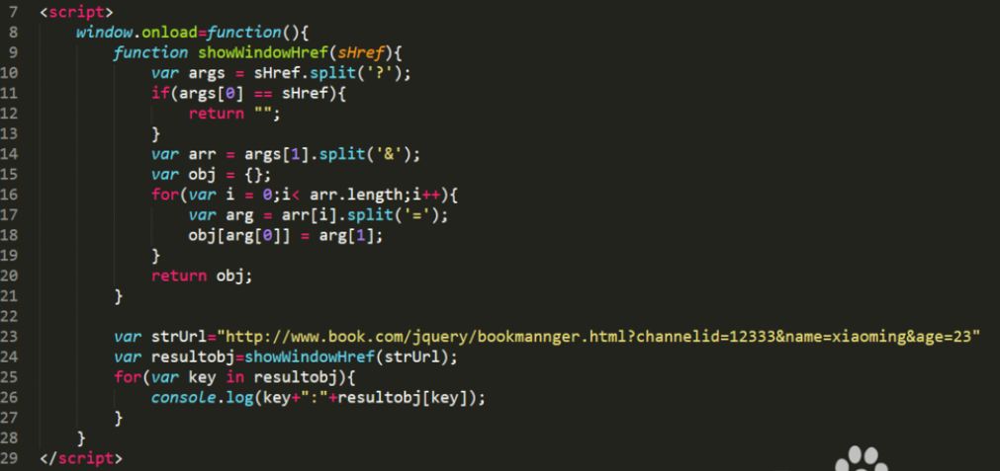

# 笔试题

1. 请写出JS有哪些数据类型，如何判断一个变量是String类型？请写出函数实现。

2. 用JS实现冒泡排序算法。

3. 请用js去除字符串空格？如：var str="  abc  abc  ",期望结果"abcabc",请写出实现代码。

4. 写出JS字符串操作函数。

5. 请用JavaScript实现，控制一个文本框只能输入正整数，如输入不符合条件则文本框全部字体标红。要求写出完整的文本框HTML代码和JavaScript逻辑代码。

6. 编写一个方法，去掉一个数组的重复元素，var arr = [0,2,3,4,4,0,2];

   ~~~
   function unique(arr){
           var isRepeated, result = [];
           for(var i=0; i<arr.length; i++){
               isRepeated = false;
               for(var j=0; j<result.length; j++){
                   if(arr[i] === result[j]){
                       isRepeated = true;
                       break;
                   }
               }
               if(!isRepeated){
                   result.push(arr[i]);
               }
           }
           return result;
   }
   var arr = [1,2,3,4,3,2,1,2,3];
   console.log(unique(arr)); // [1, 2, 3, 4]
   ~~~

   

7. JQuery有几种选择器？

8. VUE怎么定义vue-router的动态路由？怎么获取传过来的动态参数？

~~~
路由的定义，主要有以下几步：

如果是模块化机制，需要调用 Vue.use(VueRouter)

定义路由组件，如：

const Foo = {
   template: '
foo
'
};

定义路由（数组）：

const routes = [
   {
       path: '/foo',
       component: Foo
   }
];

创建 router 实例

const router = new VueRouter({
   routes
});

创建和挂载根实例

const app = new Vue({
   routes
}).mount('#app');

嵌套路由主要是通过 children，它同样是一个数组：

{
    path: '/user',
    component: User,
    children: [
        {
            path: 'file',
            component: File
        }
    ]
}

这时访问，/user/file 会映射到 File 组件

动态路由的创建，主要是使用 path 属性过程中，使用动态路径参数，以冒号开头，如：

{
    path: /user/:id
    component: User
}

这会是访问 user 目录下的所有文件，如 /user/a 和 /user/b，都会映射到 User 组件

当匹配到 /user 下的任意路由时，参数值会被设置到 this.$route.params 下，所以通过这个属性可以获取到动态参数，如：

const User = {
    template: '
User {{ $route.params.id }}
'
}

这里会根据访问的路径动态的呈现，如访问 /user/aaa 会渲染：

    User aaa

--------------------- 
作者：神圣光 
来源：CSDN 
原文：https://blog.csdn.net/weixin_41399785/article/details/79381357 
版权声明：本文为博主原创文章，转载请附上博文链接！
~~~

9. Vue的双向数据绑定原理是什么？

10. 封装一个函数，用于获取浏览器URL中查询字符串中的参数？

URL如：http://www.baidu.com/s?wd=abc&ie=utf-8&rqlang=cn

